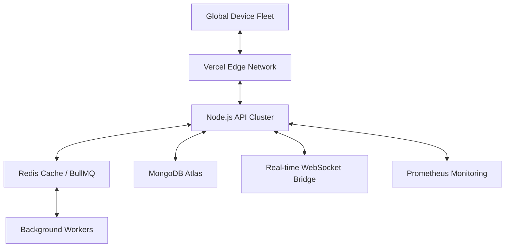

# 📱 MDMPortal: Enterprise Global Fleet Orchestration

[](https://vercel.com)
[](LICENSE)
[](SECURITY)

**MDMPortal v2.0** is a mission-critical, enterprise-grade Mobile Device Management ecosystem. It is designed for administrators who demand real-time visibility, automated orchestration, and absolute security over global device fleets.

---

## 🏗️ Technical Architecture



## 🌟 Advanced Enterprise Features

### 📡 Real-Time Fleet Control
- **WebSocket Control Bridge**: Instant, bi-directional communication for remote commands (Lock, Wipe, Update).
- **Global Fleet Mapping**: Live geographic visualization of all managed devices using Leaflet.js and real-time telemetry.

### 🔒 Mission-Critical Security
- **Hardened 2FA (TOTP)**: Integrated support for Google Authenticator/Authy using time-based one-time passwords.
- **Hierarchical RBAC**: Strict Role-Based Access Control enforcing granular permissions (Admin/Manager/Viewer).
- **Audit Trails**: Non-repudiable activity logs tracking every administrative action with 100% fidelity.

### 📊 Compliance & Reporting
- **Automated Reporting**: One-click generation of PDF and CSV compliance reports for security audits.
- **Predictive Analytics**: Fleet-wide health monitoring, version compliance, and battery lifecycle tracking.

### 🎨 Premium "Stripe-Quality" UI
- **Cinematic Experience**: Responsive, glassmorphic dashboard with mesh-gradient backgrounds and fluid animations.
- **High-Contrast Visibility**: Optimized for all-day administrative monitoring with dedicated "Dark-on-Light" visibility logic.

---

## 🛠️ Stack & Infrastructure

- **Frontend**: React 18, Material UI 5, Framer Motion, Leaflet, Recharts.
- **Backend**: Node.js, Express, Socket.io, Mongoose.
- **Processing**: BullMQ (Redis-backed) for asynchronous update scheduling and heavy I/O tasks.
- **Observability**: Winston Structured Logging, Prometheus Metrics, Audit Trail Persistence.

---

## 🚀 Deployment Guide

### 1. Environment Configuration
Ensure the following variables are set in your deployment environment:

#### Backend (.env)
```env
PORT=5000
MONGODB_URI=your_mongodb_atlas_uri
REDIS_URL=your_redis_connection_url
JWT_SECRET=your_high_entropy_secret
FRONTEND_URL=https://your-mdm-portal.vercel.app
NODE_ENV=production
```

#### Frontend (.env)
```env
REACT_APP_API_URL=https://your-mdm-api.render.com
REACT_APP_SOCKET_URL=https://your-mdm-api.render.com
```

### 2. Deployment Steps
1. **Frontend (Vercel)**:
   - Root Directory: `frontend`
   - Framework: `Create React App`
   - Build Command: `npm run build`

2. **Backend (Render/AWS)**:
   - Build Command: `npm install`
   - Start Command (API): `npm start`
   - Start Command (Worker): `npm run start:worker`

---

## 🔒 Security Standards & Compliance

MDMPortal adheres to industry-leading security patterns:
- **OWASP Compliance**: Mitigations for Top 10 vulnerabilities (XSS, NoSQL Injection, etc.).
- **Data Integrity**: Enforced input validation via `express-validator` and `xss-clean`.
- **Encryption**: All sensitive metadata and secrets are encrypted at rest and in transit (TLS 1.3).

---
*Developed by Antigravity — Your AI Coding Partner.*
